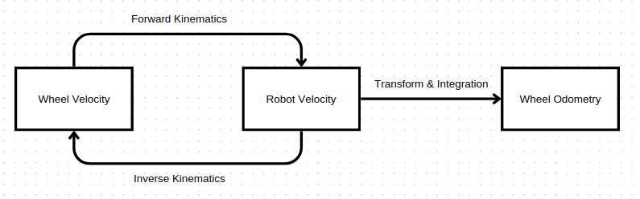
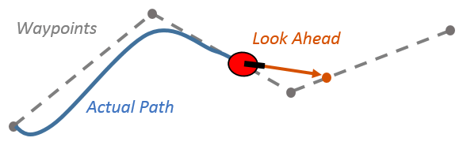

# Lab1-Local-Planner
## 1. Getting Started
## 1.1 ROS2 setup environment
Follow the [Official ROS 2 tutorial](https://docs.ros.org/en/foxy/Tutorials/Colcon-Tutorial.html) to create your Colcon workspace.

```bash
mkdir ~/your_workspace
cd ~/your_workspace
colcon build
source install/setup.bash
```

To automate workspace setup every time you open a new terminal, add the following line to your `~/.bashrc` or `~/.bash_profile` file:

```bash
echo "source ~/your_workspace/install/setup.bash" >> ~/.bashrc
source ~/.bashrc
```

## 1.2 Intallation package
To installation this project

```bash
cd ~/your_workspace
git clone https://github.com/tuchapong1234/Lab1-Local-Planner.git
```

## 1.3 Running robot
To start control robot you can run launch file

```bash

```
```bash
ros2 launch carver_bringup carver_bringup.launch.py
```

# 3. Odometry
## 3.1 Wheel Odometry 
wheel odometry is one of methods to estimate pose of the robot. It involves using sensors, usually encoders, mounted on a vehicle's wheels to measure their rotational movement. By tracking the number of rotations with robot description (wheel diameter, distance between wheel) can use to calculate how far the vehicle has traveled. This information is then used to estimate the vehicle's position and orientation based on the assumption that the wheels have not slipped or skidded significantly. While wheel odometry is a useful method for estimating short-term movement in robotics and autonomous vehicles, it can be affected by wheel slippage, uneven terrain, and other factors, leading to inaccuracies over time.

&emsp;&emsp;&emsp;&emsp;&emsp;&emsp;

### Forward Kinematics 


&emsp;&emsp;&emsp;&emsp;&emsp;&emsp;&emsp;&emsp;&emsp;&emsp;&emsp;&emsp;&emsp;&emsp;&emsp;&emsp;&emsp;&emsp;&emsp;&emsp;&emsp;&emsp;&emsp;&emsp;$w_{robot}\ =\frac{r\cdot\dot{\phi_{L}}\ -\ r\cdot\dot{\phi_{R}}\ }{B}$


&emsp;&emsp;&emsp;&emsp;&emsp;&emsp;&emsp;&emsp;&emsp;&emsp;&emsp;&emsp;&emsp;&emsp;&emsp;&emsp;&emsp;&emsp;&emsp;&emsp;&emsp;&emsp;&emsp;&emsp;$v_{robot}\ =\frac{r\cdot\dot{\phi_{L}}\ +\ r\cdot\dot{\phi_{R}}\ }{2}$

### Inverse Kinematics 

&emsp;&emsp;&emsp;&emsp;&emsp;&emsp;&emsp;&emsp;&emsp;&emsp;&emsp;&emsp;&emsp;&emsp;&emsp;&emsp;&emsp;&emsp;&emsp;&emsp;&emsp;&emsp;&emsp;&emsp;$\dot{\phi_{L}}\ =\ \ \frac{2\cdot v_{robot}\ +\ B\cdot w_{robot}}{2\cdot r}$

&emsp;&emsp;&emsp;&emsp;&emsp;&emsp;&emsp;&emsp;&emsp;&emsp;&emsp;&emsp;&emsp;&emsp;&emsp;&emsp;&emsp;&emsp;&emsp;&emsp;&emsp;&emsp;&emsp;&emsp;$\dot{\phi_{R}}\ =\ \ \frac{2\cdot v_{robot}\ -\ B\cdot w_{robot}}{2\cdot r}$

Where:

$w_{robot}$ is the angular velocity of robot.

$v_{robot}$ is the linear velocity of robot.

$r$ is the radius of the wheel.

$B$ is the distance between the wheel.

$\dot{\phi_{L}}\ $ is the angular velocity of left wheel.

$\dot{\phi_{R}}\ $ is the angular velocity of right wheel.

In this work we use 
- Forward kinematic to transform Wheel velocity or `/cmd_vel` to robot velocity or `/cmd_vel`
- Inverse kinematic to transform robot velocity or `/cmd_vel` to Wheel velocity or `/cmd_vel`

# 4. Local Planner

A local planner is use to navigate by constrant of immediate obstacles and make short-term decisions. It's like the brain's reflexes, quickly adjusting movement based on what's directly in front of it. Instead of planning a whole journey, it focuses on the next few steps, considering things like nearby objects, terrain, and the robot's capabilities to choose the best path in real-time. So, while the global planner maps out the overall route, the local planner handles the nitty-gritty details to keep things moving smoothly.

## 4.1 Pure Pursuit Algorithm
Pure Pursuit Algorithm is a method used in robotic or autonomous vehicle control for path tracking. It calculates the steering commands required to follow a specified path by continuously aiming to intercept a reference point on that path. The algorithm works by selecting a point ahead of the vehicle along the desired path. This point serves as the target for the vehicle to reach.The algorithm generates steering commands that guide the vehicle towards the path while maintaining a smooth trajectory.

&emsp;&emsp;&emsp;&emsp;&emsp;&emsp;&emsp;&emsp;&emsp;&emsp;&emsp;&emsp;

### Pseudo Code

    lookahead distance

    Initialize empty arrays p_x and p_y

    Initialize current_pose_index

    For i from current_pose_index to the end of path:

        Append path[i].pose.position.x to p_x

        Append path[i].pose.position.y to p_y

    Convert p_x and p_y to numpy arrays p_x_np and p_y_np

    Calculate distance_np as the Euclidean distance between p_x_np, p_y_np and robot_pose.position.x, robot_pose.position.y

    Find indices where distance_np is greater than lookahead_distance

    If indices array is not empty:
        Set first_index as the first index in indices
        Find the index of the minimum distance within indices and set it as min_goal_point_idx
    Else:
        Set first_index and min_goal_point_idx as 0
        Print "No value found above the threshold."

    Update current_pose_index based on min_goal_point_idx and first_index

    Calculate robot_orientation from robot_pose.orientation

    Calculate transformation matrix H_wr using robot_orientation and robot_pose.position

    Calculate transformation matrix H_wg using path[current_pose_index].pose.position

    Calculate inverse of H_wr and store it in inv_H_wr

    Calculate transformation matrix H_rg by multiplying inv_H_wr and H_wg

    Create a goal_point PoseStamped object with frame_id "base_link" and set its position based on H_rg

    Create a goal_marker PoseStamped object with frame_id "map" and set its position based on path[current_pose_index].pose.position

    Publish goal_marker

    Return goal_point

### Result

## 5. Obstacle Avoidance

### Pseudo Code

### Result